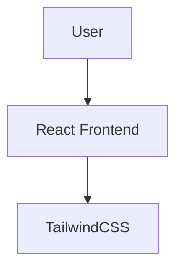

# 👟 Nike Clone - React & Tailwind CSS

A **modern, fully responsive e-commerce Nike Clone** built with **React & Tailwind CSS**. This project replicates the Nike store experience with an intuitive UI, animations, and dynamic product listings.

---

## 📌 Features

✅ **Fully Responsive** – Mobile-first design with Tailwind CSS.  
✅ **Smooth Animations** – Framer Motion animations for a seamless experience.   
✅ **Optimized Performance** – Fast loading with React and optimized assets.  

---

## 🖼️ Preview

### 📌 Live View:

You can view the live demo of the project here:

[](https://nike-clone-six-rho.vercel.app/)


---

## 🛠️ Tech Stack

🔹 **React** – Frontend framework  
🔹 **Tailwind CSS** – For modern styling   

---

## 🚀 Installation & Setup

### 🔧 Clone the Repository:
```bash
 git clone https://github.com/sahil1476/NikeClone.git
 cd NikeClone
```

### 📦 Install Dependencies:
```bash
 npm install
```

### ▶️ Run the App:
```bash
 npm run dev
```

---

## 🖥️ Architecture Diagram



---

## 📜 License

This project is **open-source**.

---

### 🌟 Like this project? Give it a ⭐ on GitHub!

[](https://github.com/sahil1476/)

